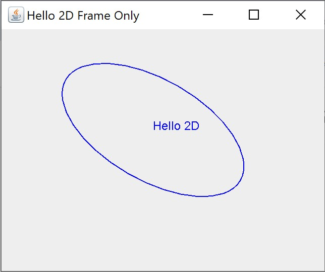
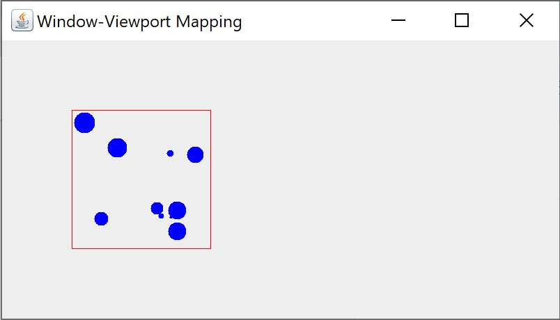
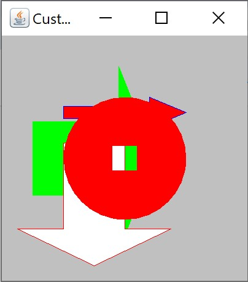
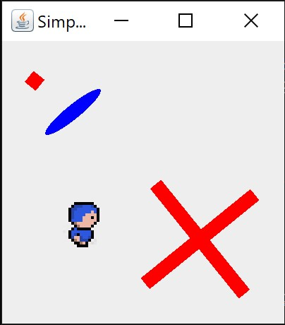
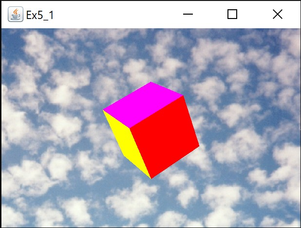
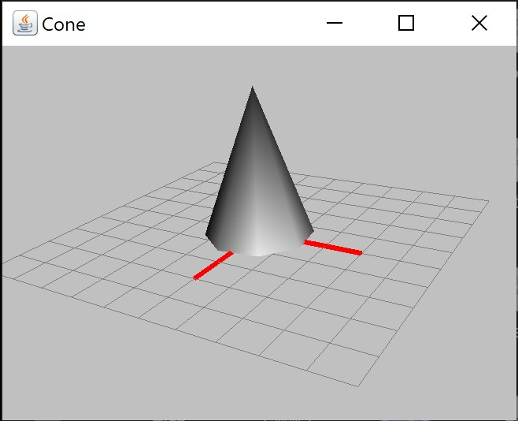
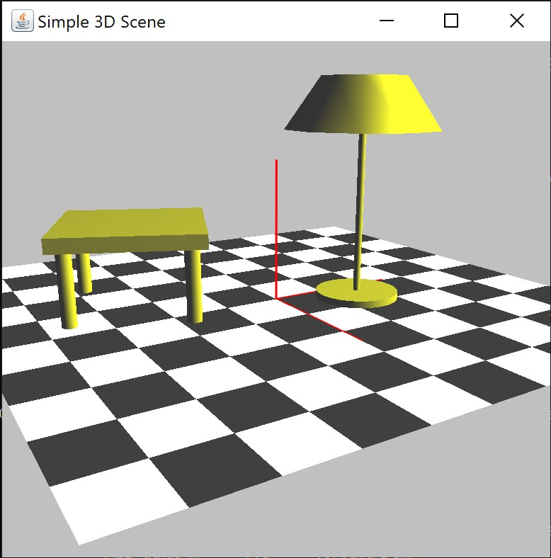
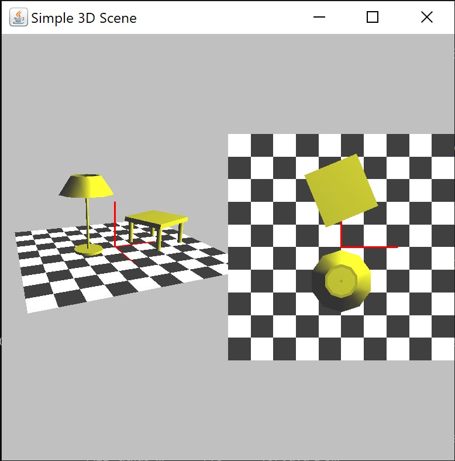
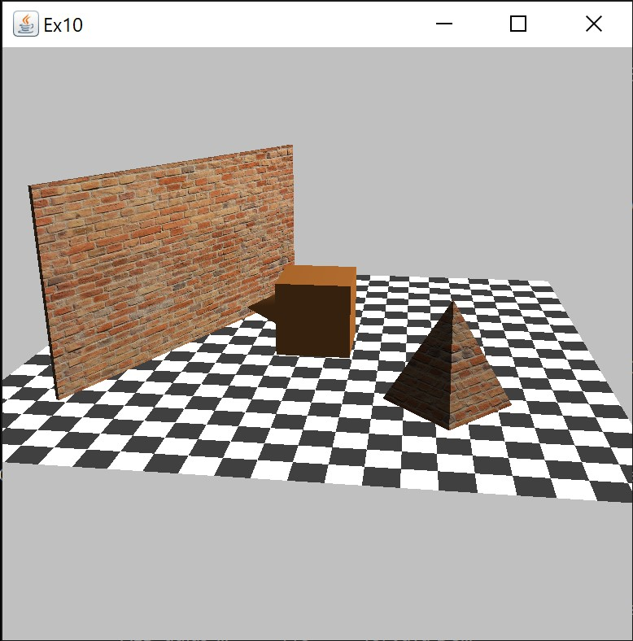
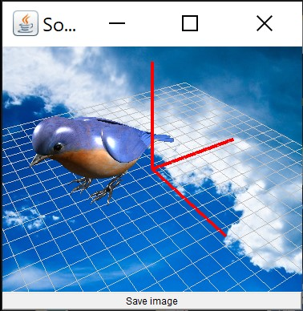

# Computer Graphics – 2D and 3D Exercises in Java
This repository contains the source code of the exercises developed in the practical sessions of the Computer Graphics course. 
The exercises illustrate key concepts of 2D and 3D Computer Graphics (2023/2024). The implementations use the **Java 2D** and **Java 3D** libraries, 
together with the educational libraries **CGLib2D** and **CGLib3D**, developed within the course to facilitate the understanding of fundamental 
computer graphics principles. 

The figures presented below, organised by chapter, show screenshots of the applications produced in the corresponding exercises.

### Chapter 2

  
  
  
  

### Chapter 3

  
  

### Chapter 4

  
  
  

### Chapter 5

  

### Chapter 6

  

### Chapter 7

  

### Chapter 8

  

### Chapter 9

  

### Chapter 10

  
  

### Chapter 11

  
  

### Chapter 12

  
  

